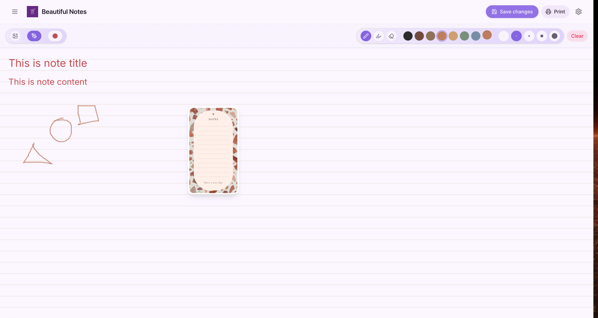

# ✨ Beautiful Notes — Aesthetic Note-Taking App

A Next.js note-taking app focused on pretty paper templates, handwriting fonts, drawings, and fast printing/export to PDF.

## Features

- Multi-page notes with smooth editing
- Aesthetic paper templates with curated styling
- Custom templates saved locally
- Handwriting-style font selection
- Drawing tools (pen/highlighter/eraser) and image placement
- One-click print/export to PDF
- Installable PWA with offline support

## Tech stack

- Next.js 16 (App Router) + React 19
- Tailwind CSS + Radix UI primitives
- Supabase (Postgres + Storage)
- Puppeteer (`puppeteer-core`) + `@sparticuz/chromium` for PDF generation

## Project layout (high level)

- `app/` – Next.js routes (UI + API routes)
- `components/` – editor UI, pickers, and shared UI components
- `hooks/` – app-specific state (notes, templates, drawing, images)
- `lib/` – utilities (Supabase client, note styles, print cache helpers)
- `types/` – shared TypeScript types
